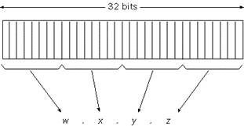
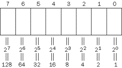

# IP Addressing
32位逻辑地址，以下三种组成：
- Unicast
- Broadcast
- Multicase


## IP Addresses的表达
32位二进制值，可以转化为4段十进制。（0-255）





IP地址用于IP header的Source Addr与Dest Addr字段。

## Unicast IP Addresses
每一个使用TCP/IP的网络接口必须由独一无二的IP地址识别。
- Unicast IP Address\
由Network ID与Host ID组成，用以表明所属子网。

> Rules for Enumerating Network IDs
> - Network ID不能以127开始。\
> 所有127.x.y.z预留为loopback addresses.\
> - Netowrk ID不能全部设为1或0\
> 全部为1，预留为广播地址。\
> 全部为0，预留在本地表示本机。\

## 子网与子网掩码
子网用于更高效地使用地址空间。通过分割Network ID,创建更小的广播空间。\
**Subnet Mask**\
Network ID位置以1表示\
Host ID位置以0表示\
| Address Class | Bits for Subnet Mask                | Subnet Mask   |
| ------------- | ----------------------------------- | ------------- |
| Class A       | 11111111 00000000 00000000 00000000 | 255.0.0.0     |
| Class B       | 11111111 11111111 00000000 00000000 | 255.255.0.0   |
| Class C       | 11111111 11111111 11111111 00000000 | 255.255.255.0 |
**另一种Network ID表达方式**\
192.168.1.0 255.255.255.0
192.168.1.0/16\

# IP Routing
## Introduction to IP Routing
在本章中我们做以下定义：
- Node: A network device running the TCP/IP protocol.
- Host: A TCP/IP node that does not have routing capability.
- Router/Gateway: A TCP/IP node that does have routing capability.
\
### Direct and Inderect Deliveries
若Sending Host直到对方在自己所在子网，便根据对方MAC地址直接发送；若不在，则根据Routing Table发向中间设备，同样发送至中间设备地MAC地址。

# Internet Control Message Protocol (ICMP)
## ICMP Messaage Structure
ICMP消息由ICMP header及ICMP message组成，由IP header使用IP Protocol Number封装为IP datagram发出。\
ICMP消息地通用字段：
- Type: 消息类型，比如Echo，Echo Reply
- Code: 表明了Type的种类组成。若仅一众Type，则Code为1。
- Checksum:
- Type-Specific Data: 根据Type而来的额外信息。
## Ping Utility
Ping命令测试了Reachability，Name Resolution，Source Routing，Network Latency。\
Ping命令相当于发送了一条ICMP Echo消息。
```powershell
ping domain.com -n 10 -l 65500
# 向domain.com发送10条大小为65500的包
```

